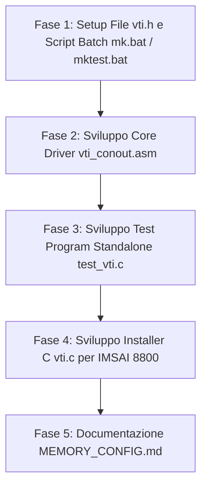

# Piano di Progetto Definitivo: CP/M BIOS Patch per Schede Video S-100 (VTI e VDM-1)

Questo documento definisce il piano architetturale, tecnico e operativo per abilitare l'output video su schede grafiche memory-mapped per bus S-100 con **CP/M 2.2b** (Intel 8080 / Z80), specificamente tarato per:
1. **IMSAI 8800** con scheda **Polymorphic Systems VTI-64** (VRAM a `0xE800`)
2. **Altair 8800** con scheda **Processor Technology VDM-1** (VRAM a `0xCC00`)

---

## 1. Sintesi e Obiettivi del Progetto

### 1.1 Contesto Operativo e Configurazioni Target

- **Configurazione 1: IMSAI 8800 + Polymorphic Systems VTI-64**:
  - **Macchina target**: IMSAI 8800 (CPU Intel 8080 a 2 MHz, bus S-100).
  - **Sistema Operativo**: CP/M 2.2b (Deramp 56K).
  - **Scheda Video**: Polymorphic Systems VTI-64 (64 caratteri × 16 righe, 1024 byte).
  - **Indirizzamento VRAM**: Memory-Mapped a partire dall'indirizzo **`0xE800`** (`0xE800` - `0xEBFF`).
  - **Driver Residente TSR**: Caricato in RAM alta a **`0xE000`** (`0xE000` - `0xE159`).
  - **Set Caratteri**: ROM alfanumerica con bit 7 abilitato (`OR 80h`), sfondo con spazio `$A0` ($128+32$), cursore grafico solido `$00`.

- **Configurazione 2: Altair 8800 + Processor Technology VDM-1**:
  - **Macchina target**: Altair 8800 (CPU Intel 8080 a 2 MHz, bus S-100).
  - **Sistema Operativo**: CP/M 2.2b.
  - **Scheda Video**: Processor Technology VDM-1 (64 caratteri × 16 righe, 1024 byte).
  - **Indirizzamento VRAM**: Memory-Mapped a partire dall'indirizzo **`0xCC00`** (`0xCC00` - `0xCFFF`).
  - **Driver Residente TSR**: Caricato in RAM alta a **`0xE000`** (`0xE000` - `0xE159`).
  - **Set Caratteri**: ASCII standard a 7 bit (`$20..$7E`), sfondo con spazio `$20`, cursore dinamico in **video inverso** (`carattere XOR 80h`).

- **Configurazione 3: Ambiente di Prova su Emulatore Z80 (GP)**:
  - Permette di collaudare sia il profilo **IMSAI/VTI** sia il profilo **Altair/VDM-1** con VRAM a **`0xC000`** e driver TSR a **`0x5000`**.

### 1.2 Problema Risolto
Attualmente il sistema opera esclusivamente via console seriale. La scheda VTI funziona solo se indirizzata direttamente da programmi custom. Il BIOS del CP/M non la riconosce, quindi l'output di BDOS/CCP e di tutti i software standard CP/M (`DIR`, `STAT`, `ED`, `MBASIC`, ecc.) non appare a schermo.

### 1.3 Strategia di Soluzione (Patch BIOS TSR)
Invece di modificare e ricompilare il BIOS completo sul disco floppy virtuale, si adotta una patch residente dinamica tramite l'utilità **`VTI.COM`**:
1. `VTI.COM` viene caricato dal TPA (`0x0100`).
2. Copia il driver video residente in un'area di memoria alta protetta: **`0xE000` - `0xE7FF`** (2 KB liberi tra il BIOS 56K a `0xDFFF` e la VRAM VTI a `0xE800`).
3. Intercetta il vettore `CONOUT` nella Jump Table del BIOS (`BIOS_BASE + 0x000C`).
4. Reindirizza `CONOUT` verso la routine `VTI_CONOUT` a `0xE000`.
5. La routine `VTI_CONOUT`:
   - Scrive e formatta il carattere nella memoria video VTI `0xE800` (gestendo X/Y, a-capo, scrolling su 16 righe, control codes e cursore).
   - Esegue un salto finale alla routine seriale originale del BIOS, garantendo l'output simultaneo sia sul monitor VTI che sul terminale seriale.
6. `VTI.COM` stampa un messaggio di avvenuta attivazione ed esce tornando al prompt di CP/M.

---

## 2. Decisioni di Design Concordate (/grill-me)

In seguito alla fase di allineamento e intervista, sono state stabilite le seguenti specifiche:

1. **Set di Caratteri di Controllo (No Sequenze Escape)**:
   - Il driver gestisce in modo rapido ed efficiente i codici ASCII fondamentali:
     - `0x0D` (CR): Ritorno carrello a inizio riga (`X = 0`).
     - `0x0A` (LF): Avanzamento riga (`Y++`). Se `Y >= 16`, attiva lo scrolling.
     - `0x08` (BS): Backspace a sinistra (`X--`).
     - `0x09` (TAB): Avanzamento al tab-stop successivo (multiplo di 8 colonne).
     - `0x0C` (FF): Clear screen completo e posizionamento cursore a `(0, 0)`.
     - `0x07` (BEL): Ignorato su video, passato alla seriale.
   - Nessun overhead o complessità legata a parser di escape sequences `ESC`.
2. **Visualizzazione Cursore Video e Caratteri Speciali VTI**:
   - **Cursore a Blocco Pieno**: Codice esadecimale **`0x00`** (`$00`, carattere grafico pieno).
   - **Spazio Vuoto (Blank/Space)**: Codice esadecimale **`0xA0`** (`$A0`, calcolato come `128 + 32 = 160`, ovvero bit 7 alto + codice ASCII spazio `0x20`).
   - Il cursore a blocco pieno (`0x00`) viene renderizzato alla posizione attiva `(X, Y)` e sovrascritto dal carattere in arrivo (o da `0xA0` per cancellazioni/spazi).
   - Le routine di Clear Screen (`0x0C`) e di riempimento dell'ultima riga dopo lo scrolling riempiono la VRAM con il carattere di spazio vuoto `0xA0`.
3. **Interfaccia Eseguibile `VTI.COM`**:
   - Modalità "Solo Installazione": `VTI.COM` si occupa unicamente di caricare la routine residente a `0xE000`, applicare la patch alla Jump Table del BIOS, stampare il messaggio di conferma e ritornare al CCP.
4. **Target CPU e Toolchain**:
   - Rigorosamente **Intel 8080** (compilazione con `z88dk` tramite flag `-m8080 +cpm`).
5. **Ambiente di Test & Verifica**:
   - Generazione del programma di test standalone **`TESTVTI.COM`** (`tests/test_vti.c`) e documentazione precisa sulla mappa di memoria per la verifica sull'emulatore.

---

## 3. Mappa di Memoria di Sistema (CP/M 56K)

| Indirizzi (HEX)    | Dimensione | Utilizzo |
|--------------------|------------|----------|
| `0x0000` - `0x00FF` | 256 byte   | **Page Zero**: Vettori di boot, IOBYTE (`0x0003`), default DMA (`0x0080`) |
| `0x0100` - `0xB0FF` | ~44 KB     | **TPA (Transient Program Area)**: Esecuzione programmi e caricamento `VTI.COM` |
| `0xB100` - `0xB8FF` | 2.0 KB     | **CCP (Console Command Processor)** |
| `0xB900` - `0xC6FF` | 3.5 KB     | **BDOS (Basic Disk Operating System)** |
| `0xC700` - `0xDFFF` | 6.25 KB    | **BIOS CP/M 2.2b** (Deramp 56K con buffer di traccia) |
| **`0xE000` - `0xE7FF`**| **2.0 KB** | **Area RAM Libera: Driver Residente VTI (`vti_conout.asm`)** |
| **`0xE800` - `0xEBFF`**| **1.0 KB** | **Memory-Mapped Video RAM Scheda Polymorphic VTI (64×16)** |
| `0xEC00` - `0xF7FF` | 3.0 KB     | Area RAM libera / Espansioni bus S-100 |
| **`0xF800` - `0xFFFF`**| **2.0 KB** | **EPROM Scheda DeRamp FDC+**: Monitor di boot **AMON** / ALTMON / Serial Drive Loader |

---

## 4. Architettura Tecnica del Driver

### 4.1 Calcolo Indirizzi Video Parametrico (`VTI_BASE_HI`)
L'indirizzo base della scheda video è interamente parametrico tramite la costante **`VTI_BASE_HI`**:
- **Hardware Reale (IMSAI 8800)**: `VTI_BASE_HI = 0xE8` $\rightarrow$ Base VRAM `0xE800`
- **Ambiente di Test / Emulatore**: `VTI_BASE_HI = 0xC0` $\rightarrow$ Base VRAM `0xC000`

L'indirizzo lineare per la cella $(X, Y)$ con $X \in [0, 63]$ e $Y \in [0, 15]$ è:
$$\text{Address} = (\text{VTI\_BASE\_HI} \ll 8) + (Y \times 64) + X$$

In assembly con **mnemonici Z80** (compatibili 8080):
```z80
; Definizione costante del byte alto (modificabile via compilatore / makefile)
IFNDEF VTI_BASE_HI
DEFC VTI_BASE_HI = 0E8h
ENDIF

; Calcolo indirizzo video da Y (in A) e X (in B) -> risultato in HL
calc_addr:
    ld l, a             ; L = Y
    ld h, 0             ; H = 0
    add hl, hl          ; HL = Y * 2   (equivalente DAD H)
    add hl, hl          ; HL = Y * 4
    add hl, hl          ; HL = Y * 8
    add hl, hl          ; HL = Y * 16
    add hl, hl          ; HL = Y * 32
    add hl, hl          ; HL = Y * 64
    ld a, l
    add a, b            ; aggiunge X (colonna)
    ld l, a
    ld a, VTI_BASE_HI   ; Byte alto configurabile (0xE8 o 0xC0)
    adc a, h
    ld h, a             ; HL = (VTI_BASE_HI << 8) + (Y * 64) + X
    ret
```

### 4.2 Routine di Scrolling Verticale
Quando `CURSOR_Y` raggiunge il valore 16:
1. Spostamento in blocco di 960 byte (righe 1..15) da `(VTI_BASE_HI << 8) + 64` a `(VTI_BASE_HI << 8)` tramite loop registro a registro 8080-safe.
2. Riempimento dell'ultima riga (64 byte a `(VTI_BASE_HI << 8) + 960`) con il carattere spazio vuoto VTI (`0xA0`).
3. Impostazione di `CURSOR_Y = 15`.

Esempio di blocco scroll in mnemonici Z80 (8080-safe con base parametrizzata):
```z80
scroll_vti:
    ; HL = Sorgente: riga 1 (VTI_BASE + 64 = VTI_BASE_HI:0040h)
    ld h, VTI_BASE_HI
    ld l, 40h
    ; DE = Destinazione: riga 0 (VTI_BASE = VTI_BASE_HI:0000h)
    ld d, VTI_BASE_HI
    ld e, 00h
    ld bc, 960          ; 15 righe * 64 = 960 byte
scroll_loop:
    ld a, (hl)          ; Legge byte da sorgente (LDAX)
    ld (de), a          ; Scrive byte a destinazione (STAX)
    inc hl              ; Avanza sorgente (INX H)
    inc de              ; Avanza destinazione (INX D)
    dec bc              ; Decrementa contatore (DCX B)
    ld a, b             ; Test se BC == 0
    or c
    jp nz, scroll_loop  ; Loop finché BC != 0 (JP NZ assoluto, NO JR!)

    ; Pulisce ultima riga con spazio $A0 (riga 15: offset 15*64 = 960 = 03C0h)
    ld a, VTI_BASE_HI
    add a, 03h          ; byte alto = VTI_BASE_HI + 3 (es. 0xEB o 0xC3)
    ld h, a
    ld l, 0C0h          ; byte basso = 0xC0
    ld b, 64            ; 64 colonne
    ld a, 0A0h          ; Spazio vuoto VTI
clear_last_row:
    ld (hl), a
    inc hl
    dec b
    jp nz, clear_last_row ; Loop pulizia (NO DJNZ!)
    ret
```

### 4.3 Aggancio e Chaining del BIOS
1. Lettura della word all'indirizzo `0x0001` (vettore warm boot, che punta a `BIOS + 0x0003`).
2. Calcolo `BIOS_BASE = peek16(0x0001) - 3`.
3. Vettore `CONOUT`: `BIOS_BASE + 0x000C`.
4. Lettura dell'indirizzo originale di destinazione del salto `conOut`.
5. Salvataggio del vecchio indirizzo nella variabile `OLD_CONOUT` del driver a `0xE000`.
6. Scrittura del nuovo salto: `JP VTI_CONOUT_ENTRY` all'indirizzo `BIOS_BASE + 0x000C`.
7. All'uscita da `VTI_CONOUT_ENTRY`, dopo aver aggiornato la VRAM e ripristinato i registri, esecuzione di `JP (OLD_CONOUT)`.

### 4.4 Regole di Compatibilità Mnemonici Z80 (Sottoinsieme Rigoroso 8080)

Tutto il codice assembly sarà scritto utilizzando la **sintassi mnemonica Z80** (supportata da `z80asm` di Z88DK con target 8080), rispettando rigorosamente il sottoinsieme di opcodes fisicamente presenti sul processore Intel 8080:

| Funzionalità Z80 | Istruzione Z80 Vietata | Sostituto Compatibile 8080 |
|------------------|------------------------|----------------------------|
| Salti relativi   | `JR`, `JR cc, label`   | `JP label`, `JP cc, label` |
| Loop contatore   | `DJNZ label`           | `DEC B` + `JP NZ, label`   |
| Block copy       | `LDIR`, `LDDR`         | Loop manuale `LD A,(HL)` / `LD (DE),A` / `INC HL` / `INC DE` / `DEC BC` |
| Registri indice  | `IX`, `IY`, `(IX+d)`   | Non utilizzati (usare solo coppie `BC`, `DE`, `HL`) |
| Shadow registers | `EXX`, `EX AF, AF'`    | Non utilizzati (usare stack: `PUSH`/`POP`) |
| Bit instructions | `BIT b, r`, `SET`, `RES`| Operazioni logiche `AND`, `OR`, `XOR` sull'accumulatore `A` |
| Shift/Rotate estesi | `SLA`, `SRA`, `SRL`, `RL r` | Usare `ADD A, A` (per shift sinistro) o `RLCA`, `RRCA`, `RLA`, `RRA` solo su `A` |
| Somma con carry 16-bit | `ADC HL, rp`, `SBC HL, rp` | Non esistono (esiste solo `ADD HL, rp`) |
| Negazione        | `NEG`                  | `CPL` + `INC A` |
| Interrupt modes  | `IM 0/1/2`, `RETI`, `RETN` | `EI`, `DI`, `RET` |
---

## 5. Struttura dei File di Progetto

```
vti-cpm-bios/
├── mk.bat                    # Script batch Windows per build IMSAI reale (VTI a E800, Driver a E000)
├── mktest.bat                # Script batch Windows per build ambiente di test (VTI a C000)
├── dist/
│   ├── vti.com               # Installer eseguibile CP/M per IMSAI 8800
│   └── testvti.com           # Test interattivo standalone per CP/M
├── docs/
│   ├── BIOS.ASM              # Sorgente originale BIOS CP/M 2.2b per riferimento
│   ├── MEMORY_CONFIG.md      # Guida alla memory map (IMSAI reale vs Emulatore Z80)
│   └── plan.md               # Questo documento di specifica e piano di progetto
└── src/
    ├── vti.h                 # Header con definizioni costanti parametriche
    ├── vti.c                 # Programma C installer VTI.COM
    ├── vti_conout.asm        # Driver VTI 8080 in sintassi Z80 (core VTI_CONOUT + hook wrapper)
    └── test_vti.c            # Test Standalone Interattivo (input senza echo -> vti_conout)
```

---

## 6. Strategia del Programma di Test Standalone (`TESTVTI.COM`)

Poiché l'ambiente di test presenta un BIOS CP/M 2.2 differente rispetto a quello dell'IMSAI reale, **il programma di test non tocca la Jump Table del BIOS né tenta il chaining seriale**.

### 6.1 Architettura Modulare del Driver
Il file `vti_conout.asm` è progettato in due livelli:
1. **Core `vti_conout_direct`**: Riceve il carattere nel registro `C`, elabora coordinate `(X, Y)`, control characters (`CR`, `LF`, `BS`, `TAB`, `FF`), scrolling 16 righe con `$A0` e rendering cursore `$00`. Al termine esegue un `RET` pulito.
2. **Hook Wrapper `vti_conout_hook` (usato solo da `VTI.COM`)**: Salva lo stato, chiama il core `vti_conout_direct`, ripristina lo stato ed esegue il salto `JP (OLD_CONOUT)`.

### 6.2 Funzionamento Interattivo di `TESTVTI.COM`
Invece di eseguire test scriptati rigidi, `TESTVTI.COM` implementa un **terminale interattivo trasparente (Glass TTY loop)**:
1. All'avvio pulisce lo schermo VTI (o stampa un breve messaggio di benvenuto sulla console seriale di CP/M indicando che il loop è attivo e che si può uscire con `ESC` o `Ctrl+C`).
2. Entra in un loop di lettura da tastiera **senza eco a video** (tramite chiamata BDOS Direct Console I/O funzione 6 con `E = 0xFF` o BDOS funzione 7).
3. Ogni tasto premuto viene inoltrato direttamente a **`vti_conout_direct(c)`**:
   - **Digitazione testo**: Consente al tester di digitare liberamente lettere e numeri, osservando in tempo reale la comparsa dei caratteri e l'avanzamento del cursore `$00`.
   - **Line Wrapping**: Digitando oltre la colonna 63 si verifica l'a-capo automatico.
   - **Tasti Enter / Invio**: Invia `CR` / `LF` per verificare il ritorno a inizio riga e l'avanzamento di riga.
   - **Tasto Backspace (`0x08`)**: Verifica l'arretramento e la corretta sovrascrittura.
   - **Tasto Tab (`0x09`)**: Verifica il corretto salto ai tab-stop multipli di 8.
   - **Clear Screen (es. `Ctrl+L` / `0x0C` / Form Feed)**: Verifica la cancellazione dell'intero schermo con riempimento a spazio `$A0`.
   - **Scrolling**: Continuando a premere Invio o digitando oltre la 16ª riga, il tester osserva direttamente lo scrolling fluido verso l'alto e la pulizia del fondo a `$A0`.
4. Se viene premuto il tasto di uscita (`ESC` / `0x1B` o `Ctrl+C` / `0x03`), il programma termina pulito e ritorna al prompt di CP/M.

---

## 7. Script di Compilazione Windows

Gli script batch Windows nella root integrano il rilevamento automatico dell'ambiente Z88DK (invocando `env.bat` se `zcc` non è ancora nel PATH di sistema):

### 7.1 `mk_imsai.bat` (Per Hardware Reale IMSAI 8800 con Polymorphic VTI)
- Configura `VTI_BASE_HI = 0xE8` (VRAM a `0xE800`) e `TSR_BASE_HI = 0xE0` (Driver residente a `0xE000`).
- Genera l'installer **`dist\vti.com`** e il test **`dist\testvti.com`** per IMSAI 8800.

### 7.2 `mk_altair.bat` (Per Hardware Reale Altair 8800 con Processor Technology VDM-1)
- Configura `BOARD_VDM1`, `VTI_BASE_HI = 0xCC` (VRAM a `0xCC00`) e `TSR_BASE_HI = 0xE0` (Driver residente a `0xE000`).
- Genera l'installer **`dist\vti.com`** e il test **`dist\testvti.com`** per Altair 8800.

### 7.3 `mk_gp_imsai.bat` (Per Emulatore Z80 GP - Profilo IMSAI / VTI)
- Configura `VTI_BASE_HI = 0xC0` (VRAM a `0xC000`) e `TSR_BASE_HI = 0x50` (Driver residente a `0x5000`).
- Genera i binari per collaudo rapido su emulatore con emulazione scheda VTI.

### 7.4 `mk_gp_altair.bat` (Per Emulatore Z80 GP - Profilo Altair / VDM-1)
- Configura `BOARD_VDM1`, `VTI_BASE_HI = 0xC0` (VRAM a `0xC000`) e `TSR_BASE_HI = 0x50` (Driver residente a `0x5000`).
- Genera i binari per collaudo rapido su emulatore con emulazione scheda VDM-1 (video inverso).

---

## 8. Piano Operativo delle Fasi di Sviluppo



### Fase 1: Setup Progetto
- Creazione `vti.h` con costanti parametriche (`VTI_BASE_HI`, `TSR_BASE_HI`, `CURSOR_CHAR = 0x00`, `BLANK_CHAR = 0xA0`).
- Creazione degli script di build Windows `mk.bat` e `mktest.bat`.

### Fase 2: Sviluppo Core Driver Assembly (`vti_conout.asm`)
- Implementazione in sintassi Z80 limitata all'8080.
- Routine `calc_addr`: calcolo indirizzo lineare con `VTI_BASE_HI`.
- Routine `vti_conout_direct`: gestione coordinate, control codes (`CR`, `LF`, `BS`, `TAB`, `FF`), scrolling 16 righe con `$A0`, cursore `$00`.
- Hook wrapper per `VTI.COM` con salvataggio registri e salto a `OLD_CONOUT`.

### Fase 3: Sviluppo Test Program Standalone (`test_vti.c`)
- Sviluppo di `testvti.com` che linka direttamente `vti_conout_direct` per il loop terminale trasparente interattivo.

### Fase 4: Sviluppo Installer CP/M (`vti.c`)
- Rilevamento dinamico della base BIOS da `0x0001`.
- Copia del codice residente a `TSR_BASE` (`0xE000`).
- Patch del vettore `CONOUT` a `BIOS_BASE + 0x000C`.
- Stampa messaggio di conferma e uscita al CCP.

### Fase 5: Documentazione di Configurazione Memoria
- File `MEMORY_CONFIG.md` con le istruzioni per impostare l'emulatore Z80 con VTI a `0xC000` e per trasferire i file su IMSAI 8800.
